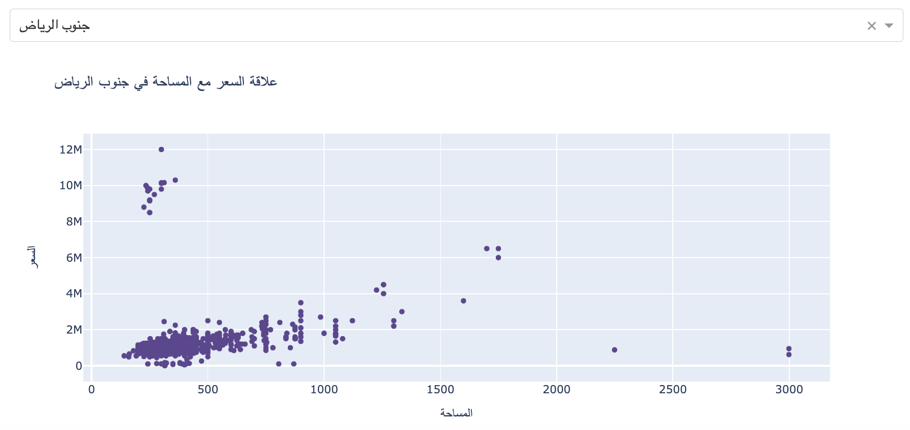
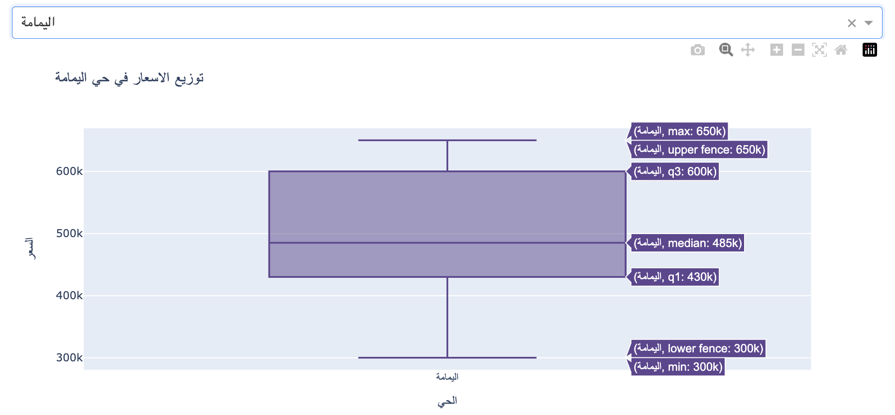
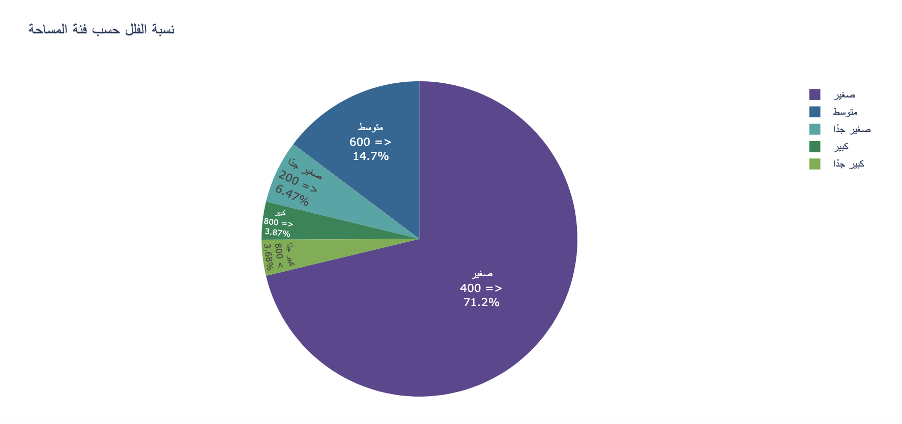
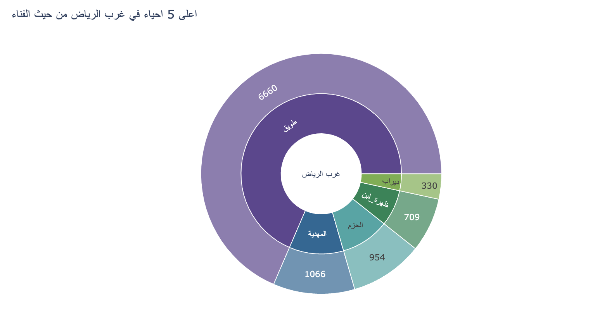
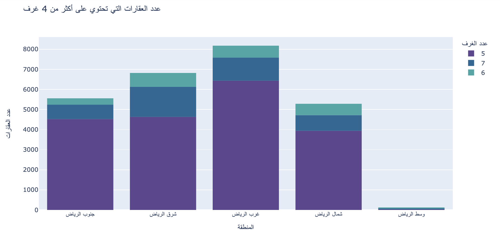
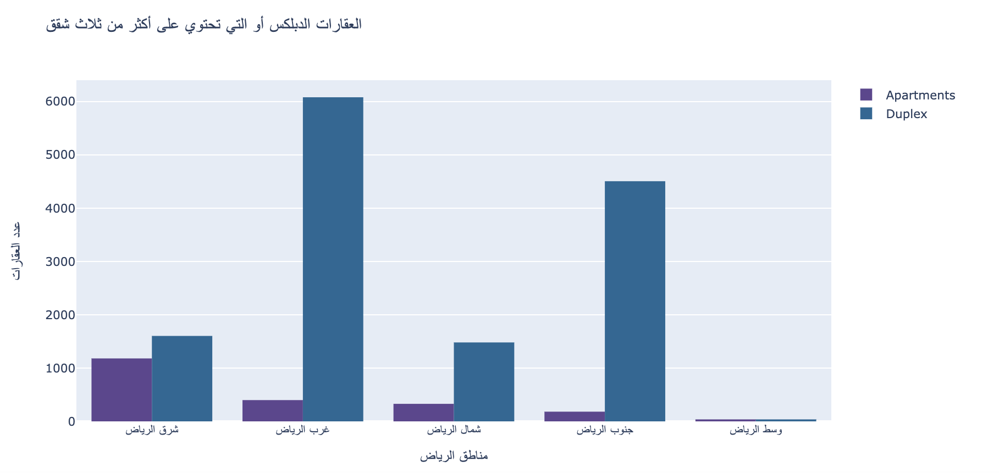
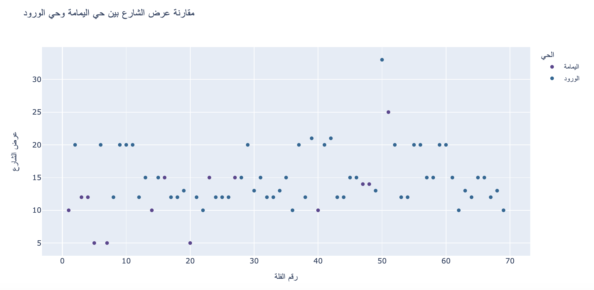
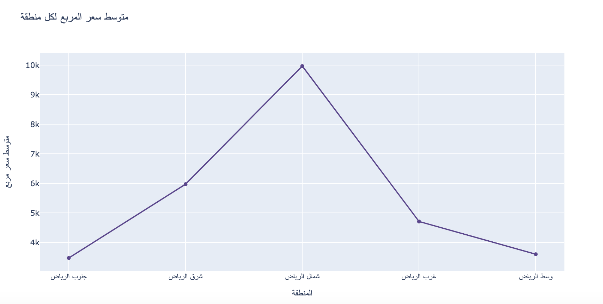
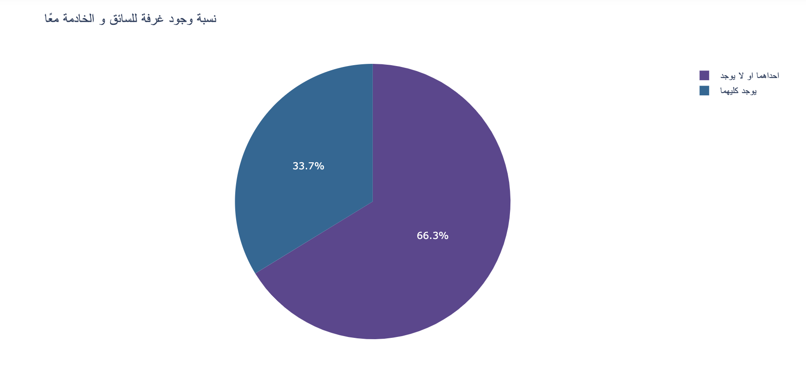
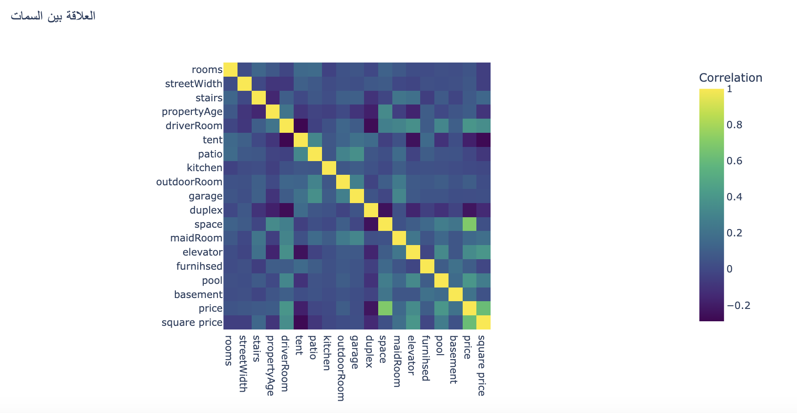

# Riyadh Villas Analysis :house_with_garden: - README

## Team Members and Duties :busts_in_silhouette:

- **Alaa Alsalman:** EDA, Data Visualization
- **Abdullah Alowayyid:** EDA, Data Visualization
- **Mohammed Almalky:** EDA, Data Visualization

## Introduction (Problem, Objectives) :dart:

In this study, we investigate a dataset that contains analysis of around 47,000 villas in Riyadh, Saudi Arabia. With the help of data cleaning, processing, analysis, and visualization, we draw out some insightful information from the dataset.

## Dataset Overview and Source

Dataset link:
 [Riyadh Villas Aqar Dataset](https://www.kaggle.com/datasets/reemamuhammed/riyadh-villas-aqar).

The dataset contains information about villas in Riyadh as following:

- **front:** direction of the villa.
- **rooms:** number of rooms.
- **lounges:** number of lounges.
- **bathrooms:** number of bathrooms.
- **streetWidth:** width of the street.
- **stairs:** does it have stairs (0 or 1 where 0 means no and 1 means yes).
- **propertyAge:** age of the property (in years).
- **driverRoom:** does it have a driver's room (0 or 1 where 0 means no and 1 means yes).
- **tent:** does it have a tent (0 or 1 where 0 means no and 1 means yes).
- **patio:** does it have a patio (0 or 1 where 0 means no and 1 means yes).
- **kitchen:** does it have a kitchen (0 or 1 where 0 means no and 1 means yes).
- **outdoorRoom:** does it have an outdoor room (0 or 1 where 0 means no and 1 means yes).
- **garage:** does it have a garage (0 or 1 where 0 means no and 1 means yes).
- **duplex:** is it a duplex (0 or 1 where 0 means no and 1 means yes).
- **space:** space of the villa.
- **apartments:** number of apartments.
- **maidRoom:** does it have a maid's room.
- **elevator:** does it have an elevator.
- **furnished:** is it furnished (0 or 1 where 0 means no and 1 means yes).
- **pool:** does it have a pool (0 or 1 where 0 means no and 1 means yes).
- **basement:** does it have a basement (0 or 1 where 0 means no and 1 means yes).
- **neighbourhood:** the neighborhood where the villa is located.
- **location:** location in Riyadh (North, South etc.).
- **price:** price of the villa.
- **square price:** price per square unit.

## The final ten insights :bar_chart:

Here are ten insightful findings from our analysis:

1. **Prices and Space Relationship based on Location:**

2. **Neighbourhood Prices Distribution:**

3. **Villas Space Categories Percentages:**

4. **Top 5 Neighbourhoods in the West of Riyadh with Patio:**

5. **Count of Villas with 4 or More Rooms:**

6. **Duplexes or Those with More Than Three Apartments:**

7. **Street Width Comparison Between Al-Yamama and Al-Woroud Neighborhoods:**

8. **Average Price per Square for Each Area in Riyadh:**

9. **Percentage of Villas with Both Driver and Maid Rooms:**

10. **Heatmap for Villas Features:**

